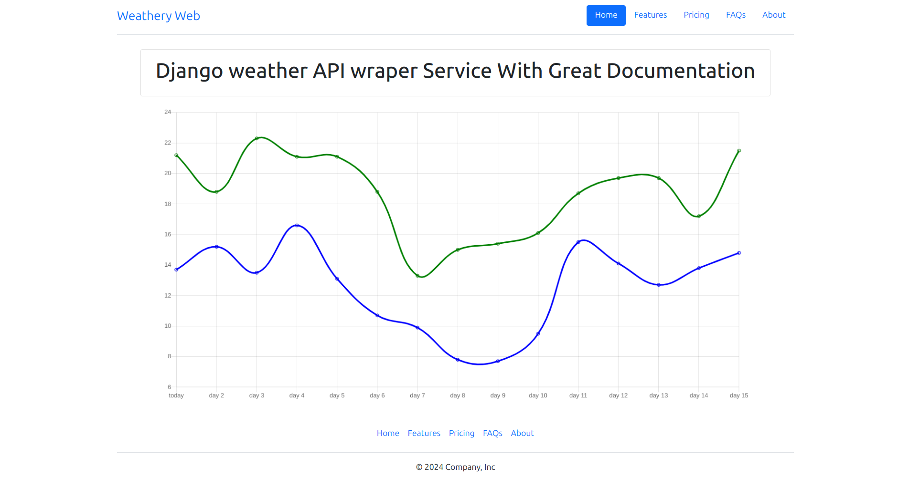
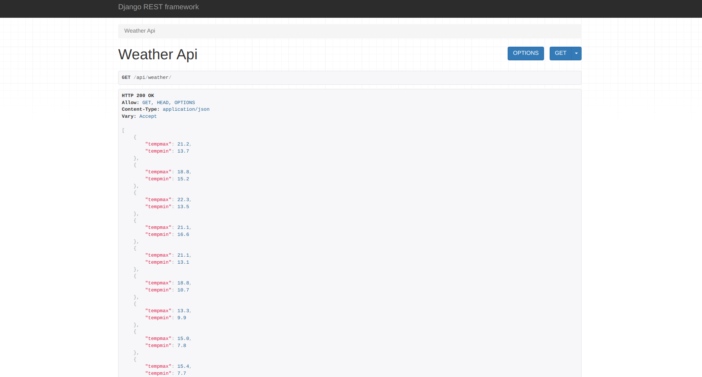

# what is weathery web ?
A **django** weather API wrapper service for __Users__ and __Data Scientists__  



## Intro
this project is meant to make Extracting the __data from an Weather DataBase__ or Making a 
**Visual and Vibrant Chart of that data** not only posible for none-programmers 
and Users but acceseble for everyone that has a working internet connection .


### here is a list of things that this project has achived

- [x] Beautifull Visual charts
- [x] Weather Support of 100% of Cities all around the world
- [x] Great Documentation For Developers
- [x] Great API Documentation For Developers

## Usage
just go to the __afisioall weathery web website__ to harness the power

___picture( of the charts )


### documentation
* more detail on the __url( the git hub page )afisioal documentation of Weathery_web
* for more detail on API check the __url( the git hub page )API documentation



# Requirements
here is some requirements for installing this project ( with some helpfull links ):
- <a href="https://www.python.org/downloads/"> python v3 + </a>
- <a href="https://pip.pypa.io/en/stable/installation/"> pip v2 + </a>
- <a href="https://virtualenv.pypa.io/en/latest/installation.html"> vertual-env v20.25.0 + </a>

# installazation for develepors

**blow is a list of Oprating Systems we support:**

  OS  | Linux | Windows | MacOs  
:---: | :---: | :---: | :---: 
Support | ✅ | ✅ | ✅

- <a href="https://github.com/KianMehrabi/weathery_web?tab=readme-ov-file#linux-and-macos">installing with Linux or MacOs</a>
- <a href="https://github.com/KianMehrabi/weathery_web?tab=readme-ov-file#windows">installing with Windows</a>


## Linux and macos

1. clone the project ( and star it please )
```git
git clone https://github.com/KianMehrabi/weathery_web.git
```
&nbsp;

2. go to the project folder
```command
cd weathery_web
```
&nbsp;

3. make a virtual Environment in you Local Computer
> [!NOTE]
> i am using virtualenv you can use others if you want
> see <a href="https://www.freecodecamp.org/news/how-to-setup-virtual-environments-in-python/"> for installing the virtual Environment </a>
```command
python -m venv venv
```
&nbsp;

4. then activate that virtual Environment in you Local Computer
> [!IMPORTANT]
> you have to close the cli ( and Re-open it ) to use it normaly again
```command
source venv/bin/activate
```
&nbsp;

5. install all the dependencies from requirements.txt 
```command
pip install -r requirements.txt
```
&nbsp;

6. go to website folder 
```command
cd website
```
&nbsp;

7. run it from localhost
> [!WARNING]
> if you have python v2 or lower we highly saggest that you upgrade to v3
```command
python3 manage.py runserver
```
&nbsp;

8. go to your favarote Web browser with this url
```command
http://127.0.0.1:8000/
```
&nbsp;


## Windows
1. clone the project ( and star it please )
```git
git clone https://github.com/KianMehrabi/weathery_web.git
```
&nbsp;

2. go to the project folder
```command
cd weathery_web
```
&nbsp;

3. make a virtual Environment in you Local Computer
> [!NOTE]
> i am using virtualenv you can use others if you want
> see <a href="https://www.freecodecamp.org/news/how-to-setup-virtual-environments-in-python/"> for installing the virtual Environment </a>
```command
python -m venv venv
```
&nbsp;

4. then activate that virtual Environment in you Local Computer
> [!IMPORTANT]
> you have to close the cli ( and Re-open it ) to use it normaly again
```command
.\venv\Scripts\activate
```
&nbsp;

5. install all the dependencies from requirements.txt 
```command
pip install -r requirements.txt
```
&nbsp;

6. go to website folder 
```command
cd website
```
&nbsp;

7. run it from localhost
> [!WARNING]
> if you have python v2 or lower we highly saggest that you upgrade to v3
```command
python3 manage.py runserver
```
&nbsp;

8. go to your favarote Web browser with this url
```command
http://127.0.0.1:8000/
```
&nbsp;


# Contributions
before Forking please make sure to Submit a Issues with the solved problem Explained , you can start with <a href="https://github.com/KianMehrabi/weathery_web/tree/main?tab=readme-ov-file#known-issues"> Known Issues Section </a>

&nbsp;

# Known Issues
- not completed document
- not completed api document
- no django web wrapper
- no integration for api
- no actual website 

# like this project ?
make sure to **__SMASH__** that __star__ button!!! 🙏
